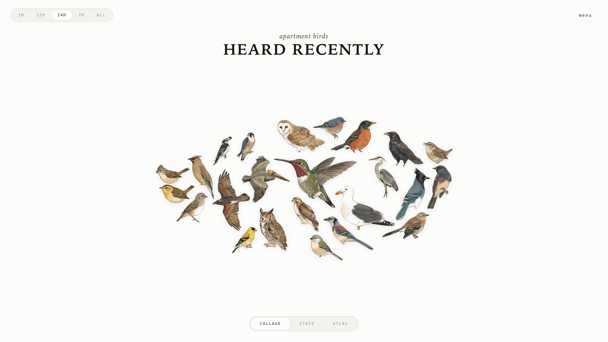

# AvianVisitors

*A live grid of the birds at your window.*

See it running at [bird.onethreenine.net](https://bird.onethreenine.net).



---

## BOM

| Qty | Description | Price | Link | Notes |
|-----|-------------|-------|------| ----- |
| 1 | Raspberry Pi (4B / 5 / Zero 2W) | ~$35-80 | [Amazon](https://amzn.to/43yLDZJ) | [See note for RPi20](https://github.com/mcguirepr89/BirdNET-Pi/wiki/RPi0W2-Installation-Guide) |
| 1 | Micro SD Card (≥32 GB) | ~$10 | [Amazon](https://amzn.to/4eGy7te) | |
| 1 | USB lavalier microphone | $16.95 | [Amazon](https://amzn.to/4vLSaMK) | |
| 1 | Pi power supply | ~$10 | - | |

Optional: a [Gemini API key](https://aistudio.google.com/apikey) to restyle illustrations, an [eBird API key](https://ebird.org/api/keygen) to filter species by region.

### Kits

I offer the bird mic and the wall frame as separate electronics kits. I put up a store for some of my open-source projects and will soon be able to offer kits cheaper than buying all the components individually, once I start buying in bulk.

- [Bird mic kit](https://theodore.net/store/avian-mic/)
- [Frame kit](https://theodore.net/store/avian-visitors/)

---

## 1. Flash the SD card

Use [Raspberry Pi Imager](https://www.raspberrypi.com/software/). Pick Raspberry Pi OS Lite (64-bit). In the customisation dialog set:

- Username
- WiFi SSID + password
- Hostname: `birdnet`
- Enable SSH with password auth

Plug the USB mic into the Pi. Place the capsule in a window or mount it outside. Boot.

---

## 2. Run the installer

Installer assumes passwordless sudo (Raspberry Pi OS Lite default - if you've tightened it, run `sudo raspi-config` -> *System Options* -> restore the default first).

```bash
ssh <your-username>@birdnet.local
curl -s https://raw.githubusercontent.com/Twarner491/AvianVisitors/avian-visitors/newinstaller.sh | bash
```

Clones this fork, installs BirdNET-Pi, symlinks the AvianVisitors overlay into the Caddy web root. Takes 20-40 minutes. Reboots when done.

Grid: `http://birdnet.local/`. Stock BirdNET-Pi UI: `http://birdnet.local/index.php`. The menu button in the top right opens an admin overlay with settings, system, log, and tool panels.

---

## 3. (Optional) Swap the illustrations

The repo ships 307 bundled Audubon *Birds of America* plates, mapped onto the BirdNET species the model can detect. Two ways to change the art:

**Import your own finished plates** — named by common name (`blue_jay.jpg`, `coopers_hawk.jpg`):

```bash
pip install -r ~/BirdNET-Pi/avian/scripts/requirements.txt
python3 ~/BirdNET-Pi/avian/scripts/import_plates.py --source ~/plates --apply --replace
```

**Or generate a kachō-e set** with Gemini (the original pipeline):

```bash
export GEMINI_API_KEY='your-key'  # image generation requires billing enabled
python3 ~/BirdNET-Pi/avian/scripts/pregen.py --labels ~/BirdNET-Pi/model/labels.txt --force
python3 ~/BirdNET-Pi/avian/scripts/cutout.py
```

Both map images to the scientific-name slugs the frontend serves. Filter generation to your region with `--ebird-region US-CA` (needs `EBIRD_API_KEY`). Full details — mapping, prompt, reference images, per-species tuning — live in [`avian/scripts/README.md`](avian/scripts/README.md).

---

## 4. (Optional) Forward off your LAN

See [`avian/forwarding/`](avian/forwarding/) for three independent recipes:

- **Cloudflare Tunnel** for a public HTTPS URL.
- **Home Assistant REST sensor** that exposes the latest detection.
- **MQTT bridge** that publishes every new detection.

---

## Repo layout

```
avian/                  # everything we add to BirdNET-Pi
├── frontend/           # static HTML/JS/CSS for the grid
├── assets/             # 307 bundled Audubon plates
├── api/                # PHP shims served by BirdNET-Pi's PHP-FPM
├── scripts/            # plate import + optional kachō-e generator
└── forwarding/         # optional HA / MQTT / Cloudflare configs
frame/                  # optional e-ink wall display
```

Everything outside `avian/` and `frame/` is upstream BirdNET-Pi.

---

## Wall frame

An optional e-ink frame mirrors the last 24h of birds onto a panel by your window. Build it from [`frame/`](frame/README.md). It can run off your own BirdNET mic, or standalone from BirdWeather data for any ZIP code with no mic at all.

---

## License

CC-BY-NC-SA-4.0, inherited from [BirdNET-Pi](https://github.com/Nachtzuster/BirdNET-Pi/blob/main/LICENSE). Non-commercial use only. See the [BirdNET-Pi README](https://github.com/Nachtzuster/BirdNET-Pi/blob/main/README.md) for full Cornell attribution.

---

- [Fork this repository](https://github.com/Twarner491/AvianVisitors/fork)
- [Watch this repo](https://github.com/Twarner491/AvianVisitors/subscription)
- [Create issue](https://github.com/Twarner491/AvianVisitors/issues/new)
